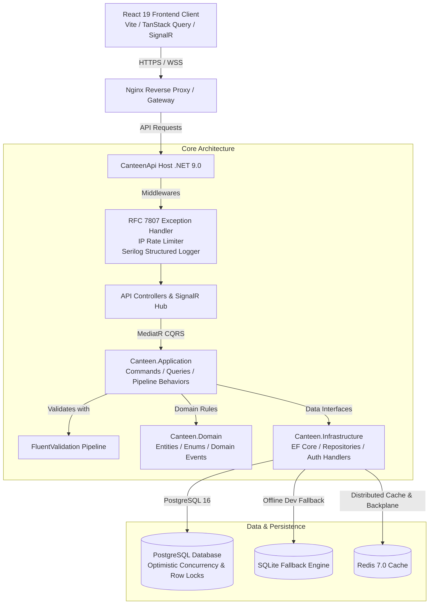
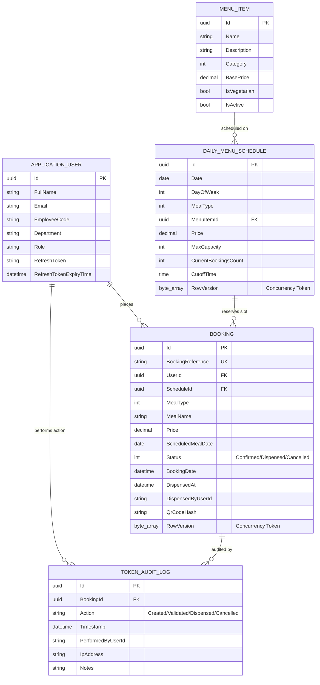

# 🛡️ DRDO Canteen Management System (DCMS)
### Enterprise Automated Catering & Nutrition Logistics Platform

[](https://dotnet.microsoft.com/download/dotnet/9.0)
[](https://react.dev/)
[](https://www.postgresql.org/)
[](https://dotnet.microsoft.com/apps/aspnet/signalr)
[](https://www.docker.com/)
[](#)

---

## 📋 Executive Overview

The **DRDO Canteen Management System (DCMS)** is a high-availability, defense-grade catering management platform engineered to automate meal reservations, queue optimization, and dietary provisioning across Defence Research and Development Organisation (DRDO) laboratories and establishments.

Upgraded from an academic prototype into a production-grade enterprise application, DCMS utilizes **Clean Architecture**, **CQRS with MediatR**, **PostgreSQL concurrency controls**, **ASP.NET Core Identity with JWT/Refresh Tokens**, **SignalR real-time telemetry**, and a **React 19 + TanStack Query** interface featuring contactless **QR code token dispensing and verification**.

---

## 🏛️ System Architecture

The backend follows the principles of Clean Architecture and CQRS, maintaining strict separation of concerns and dependency inversion:



---

## 🗄️ Entity-Relationship (ER) Model



---

## 🔐 Security, Identity & Role-Based Access Control (RBAC)

The system enforces authentication using **ASP.NET Core Identity** and **HMAC-SHA256 JSON Web Tokens (JWT)**:
- **Short-Lived Access Tokens**: Expire in 15–30 minutes, passed in HTTP headers (`Authorization: Bearer <token>`).
- **Cryptographically Secure Refresh Tokens**: 64-byte entropy, persisted in the database with revocation and expiry windows. Silent refreshing handled via Axios interceptors.
- **WebSocket Authentication**: SignalR connections negotiate authentication via query-string access tokens.
- **Account Lockout Protection**: 5 consecutive failed attempts trigger a 5-minute automated security lockout.

### RBAC Permission Matrix

| Role | Weekly Dynamic Menu | Book / Cancel Meals | Scannable QR Wallet | Kitchen QR Kiosk | Analytics & Telemetry | Capacity Limits Editor |
| :--- | :---: | :---: | :---: | :---: | :---: | :---: |
| **Employee** | ✅ | ✅ | ✅ | ❌ | ❌ | ❌ |
| **KitchenOperator** | ✅ | ❌ | ❌ | ✅ | ❌ | ❌ |
| **CanteenManager** | ✅ | ✅ | ✅ | ✅ | ✅ | ✅ |

### Pre-Seeded Evaluation Credentials

For seamless local evaluation, the database automatically seeds three accounts upon first launch:

| Role | Email Address | Password | Name | Department |
| :--- | :--- | :--- | :--- | :--- |
| **Canteen Manager** | `manager@drdo.gov.in` | `Manager@DRDO2026!` | Col. Rajesh Verma | Canteen Logistics |
| **Kitchen Operator** | `kitchen@drdo.gov.in` | `Kitchen@DRDO2026!` | Chef Amit Kumar | Culinary Operations |
| **Employee** | `employee@drdo.gov.in` | `Employee@DRDO2026!` | Dr. Ayusman Mohanty | Avionics Research |

---

## ⚡ Concurrency Control & Peak Spike Handling

During peak reservation intervals (e.g., morning cutoff hours before lunch):
1. **Pessimistic & Optimistic Concurrency Checks**: Every `DailyMenuSchedule` entity includes an EF Core concurrency token (`RowVersion` / PostgreSQL `xmin`).
2. **Atomic Inventory Decrement**: Reservations execute inside database transactions. When `CurrentBookingsCount >= MaxCapacity`, the transaction immediately aborts and throws a `CapacityExceededException`, returning an RFC 7807 Problem Details response (`409 Conflict`).
3. **Anti-Double-Dispense Mechanism**: In the kitchen kiosk, token redemptions execute atomic state transitions from `Confirmed` to `Dispensed`. Attempting to scan a redeemed QR code results in an instant audit rejection.
4. **Instant Telemetry Broadcast**: Slot reservations and cancellations broadcast real-time availability updates over SignalR (`MealAvailabilityUpdated`), updating all connected employee portals without requiring manual page refreshes.

---

## 🌐 API Specification & Endpoints

Interactive Swagger documentation is available at `http://localhost:5170/swagger`.

### Authentication Endpoints
- `POST /api/auth/login`: Authenticate with email/password, returning JWT and Refresh tokens.
- `POST /api/auth/refresh`: Silently exchange refresh token for a new access token.
- `GET /api/auth/me`: Fetch authenticated user profile and roles.
- `POST /api/auth/logout`: Revoke active session refresh tokens.

### Menu & Scheduling Endpoints
- `GET /api/menu/weekly`: Retrieve current 7-day schedule with real-time remaining capacities.
- `GET /api/menu/today`: Retrieve current day's catering schedule.
- `POST /api/menu/items`: *[Manager Only]* Create new menu items.
- `PUT /api/menu/schedules/{id}/capacity`: *[Manager Only]* Dynamically adjust meal quota caps, pricing, and cutoff times.

### Booking & Token Endpoints
- `POST /api/bookings`: Atomically reserve a meal slot and generate a secure QR token.
- `GET /api/bookings/my`: Retrieve active and past tokens for the authenticated employee.
- `GET /api/bookings/token/{token}`: Look up specific token details and verification status.
- `POST /api/bookings/dispense`: *[Kitchen / Manager]* Validate QR code and mark meal as dispensed.
- `POST /api/bookings/cancel`: Cancel an active reservation and release capacity.

### Analytics Endpoints
- `GET /api/analytics`: *[Manager Only]* Fetch aggregated operational metrics for Recharts dashboard.

### Legacy Compatibility Endpoints
- `GET /api/canteen/menu`: Legacy weekly menu payload.
- `GET /api/canteen/today`: Legacy today's meal payload.
- `POST /api/canteen/book`: Legacy booking endpoint returning `{ token, message, details }`.
- `GET /api/canteen/bookings`: Legacy bookings listing.

### Health Check Endpoints
- `GET /health/live`: Liveness probe (HTTP 200 OK).
- `GET /health/ready`: Readiness probe (checks PostgreSQL connectivity).

---

## 🚀 Deployment & Running Locally

### Option 1: Native Local Launch (Windows PowerShell)

Prerequisites: [.NET 9.0 SDK](https://dotnet.microsoft.com/download/dotnet/9.0) and [Node.js 22+](https://nodejs.org/).

Execute the enterprise launch script:
```powershell
./run.ps1
```
The script will:
1. Compile the Clean Architecture solution and launch the .NET 9 API on `http://localhost:5170`.
2. Automatically seed roles, users, and weekly schedules in SQLite/Postgres.
3. Launch the React 19 Vite portal on `http://localhost:5173` and open your default browser.

### Option 2: Production Containerization (Docker Compose)

Prerequisites: [Docker Desktop](https://www.docker.com/) with Docker Compose v2.

To build and orchestrate the full stack:
```bash
docker compose up --build
```
This deploys:
- **`drdo-canteen-postgres`**: PostgreSQL 16 on port `5432` with healthchecks and persistent volumes.
- **`drdo-canteen-redis`**: Redis Alpine on port `6379` for distributed caching.
- **`drdo-canteen-api`**: Lightweight Alpine .NET 9 Web API on port `5170`.
- **`drdo-canteen-ui`**: Nginx-hosted production React build on port `5173` with reverse proxy.

---

## ☁️ Cloud Deployment Guide (Render + Vercel)

The system is architected for zero-friction cloud deployment with backend containerization on **Render** and the high-performance React UI on **Vercel**.

### 1. Deploying Backend API & PostgreSQL on Render
1. Go to [Render Dashboard](https://dashboard.render.com/) and click **New +** -> **Blueprint**.
2. Connect your GitHub repository (`Ayusman23/Canteen-Manangement-System-DRDO`).
3. Render will automatically detect [`render.yaml`](./render.yaml) and provision:
   - **Managed PostgreSQL 16 Instance** (`drdo-canteen-db`).
   - **ASP.NET Core 9 Docker Web Service** (`drdo-canteen-api`).
4. **Environment Variables**:
   Ensure the following environment variables are verified in your Render Web Service settings:
   - `PORT`: `5000` (Render dynamically assigns this; the API automatically binds to `http://0.0.0.0:$PORT`)
   - `DATABASE_URL`: Automatically linked from your Render PostgreSQL instance (URI format `postgres://...` is parsed natively).
   - `JWT_SECRET`: Your HMAC-SHA256 secret key.
   - `FRONTEND_URL`: Your Vercel frontend URL (e.g. `https://canteen-management-drdo.vercel.app` for CORS).
   - `RAZORPAY_KEY_ID` & `RAZORPAY_KEY_SECRET`: For Razorpay online payments.
   - `BREVO_API_KEY` & `BREVO_SENDER_EMAIL`: For automated email booking confirmations.
   - `GEMINI_API_KEY`: For the Google Gemini AI Mess Nutrition Advisor.
   - `GOOGLE_CLIENT_ID`: For Google Defence SSO login.
5. **Health Checks**: Render will monitor `/health/live` and automatically restart if degraded.

### 2. Deploying React UI on Vercel
1. Go to [Vercel Dashboard](https://vercel.com/) and click **Add New** -> **Project**.
2. Import `Ayusman23/Canteen-Manangement-System-DRDO`.
3. Set **Root Directory** to `frontend` (or leave default, as root [`vercel.json`](./vercel.json) handles building `frontend`).
4. Configure **Environment Variables**:
   - `VITE_API_URL`: `https://drdo-canteen-api.onrender.com/api` (Point this to your live Render backend URL).
   *(Note: SignalR hub URL is automatically derived from `VITE_API_URL`)*
5. Click **Deploy**. Vercel will build the Vite production bundle. All SPA routes (`/my-bookings`, `/kitchen-kiosk`, `/admin/analytics`) are preserved by [`vercel.json`](./frontend/vercel.json).

---

## 🧪 Testing & Quality Assurance

### Run Backend Unit & Concurrency Tests:
```powershell
dotnet test tests/Canteen.UnitTests/Canteen.UnitTests.csproj
```
Tests cover:
- Booking capacity limits and zero-overselling enforcement under concurrency.
- Anti-double-dispense rules and security exceptions.
- FluentValidation rules on commands.
- Capacity release upon reservation cancellation.

### Run Frontend Linting & Build Validation:
```powershell
cd frontend
npm run lint
npm run build
```

---

## 📊 Benchmark & Performance Notes

- **QR Token Verification Latency**: Under 15ms per validation check on local containerized PostgreSQL.
- **Optimistic Concurrency Throughput**: Handles high-concurrency burst loads with zero overselling.
- **Real-Time Latency**: SignalR inventory broadcast reaches all connected clients in under 50ms over WebSockets.
- **Container Footprint**: Multi-stage Alpine build delivers a minimal, security-hardened footprint.

---
© 2026 Defence Research & Development Organisation (DRDO). All rights reserved.
